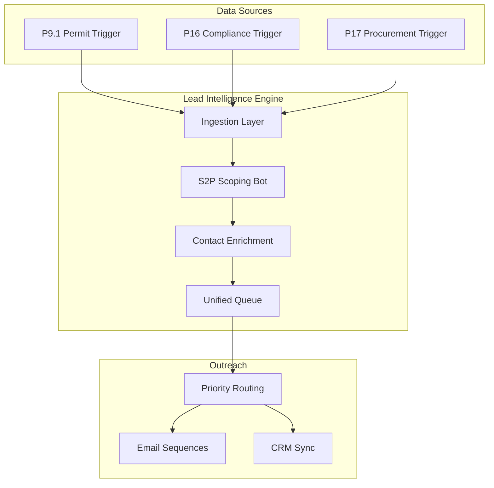
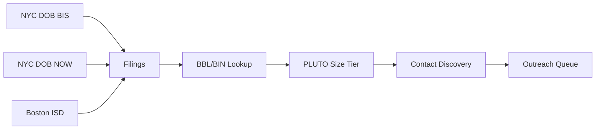
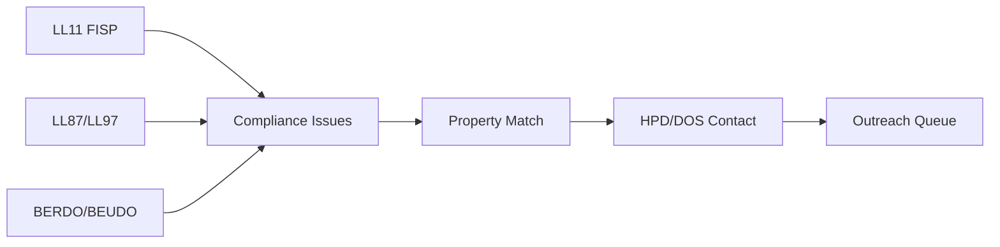
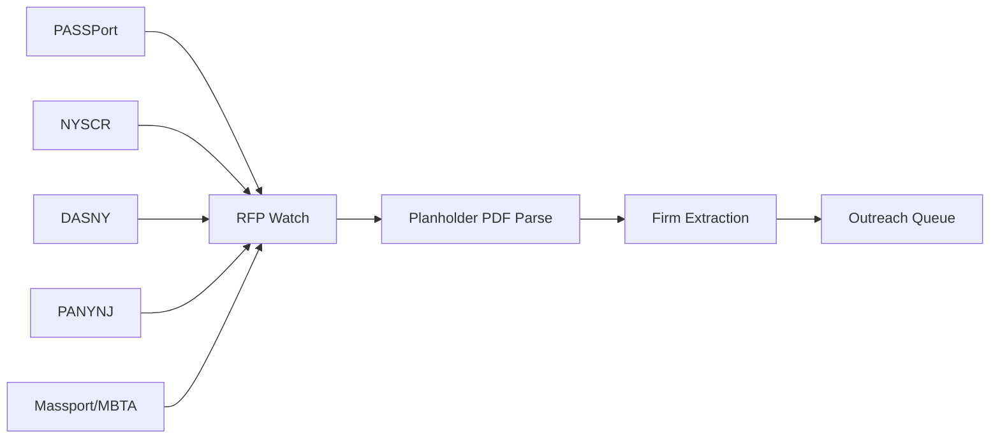
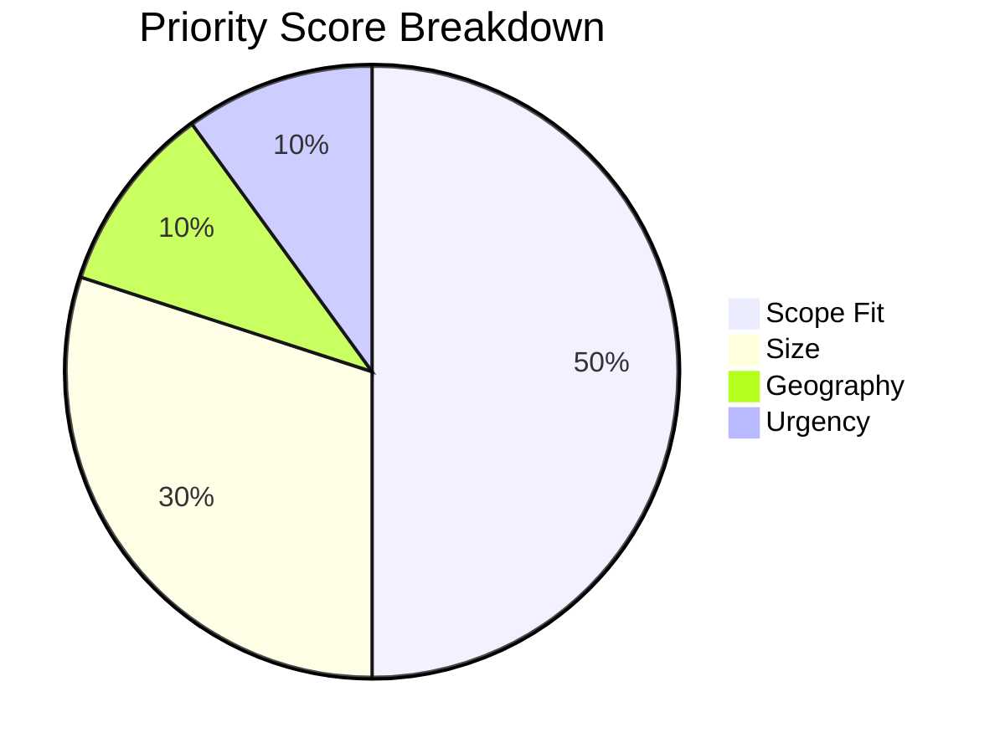
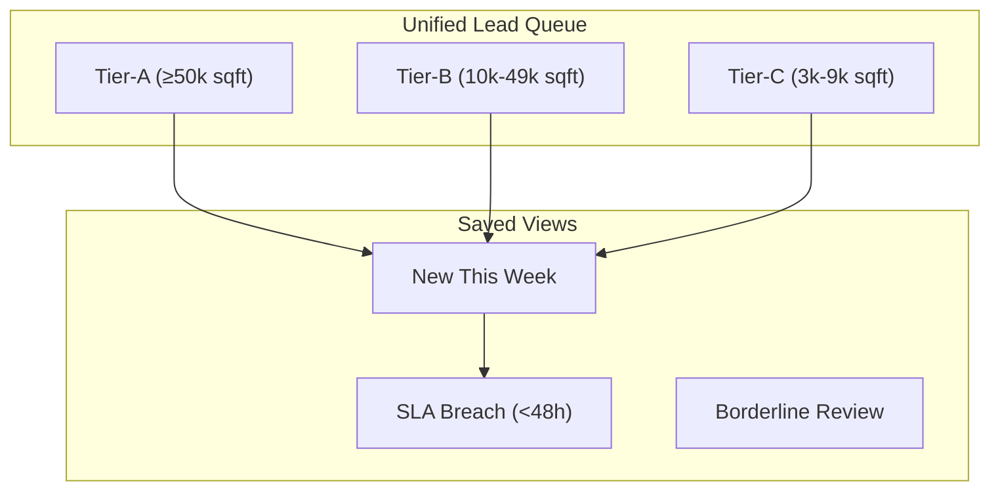

# Scan2Plan Lead Intelligence Platform

## Executive Summary

This document outlines the architecture for the **Lead Intelligence Platform**, a unified system that automates lead discovery, qualification, and outreach from three primary data streams: **Permits**, **Compliance**, and **Procurement**.

---

## System Overview

---

## The Three Trigger Pods

### P9.1 — Permit Trigger (Daily)

**Goal**: Capture design professionals named on building permits within 48 hours of filing.

| Source | Data | API |
|--------|------|-----|
| NYC DOB BIS | A1/NB filings (legacy) | ic3t-wcy2 |
| NYC DOB NOW | A1/NB filings (modern) | w9ak-ipjd |
| Boston ISD | Approved permits | data.boston.gov |
| NYC PLUTO | Building area/type | BBL lookup |

**Success Metric**: ≥8 permit-sourced meetings/quarter

---

### P16 — Compliance Trigger (Daily-Monthly)

**Goal**: Identify buildings with compliance issues (façade, energy, carbon) and contact owners/PMs.

| Program | Trigger | Frequency |
|---------|---------|-----------|
| LL11 (FISP) | UNSAFE / No Report Filed | Daily |
| LL87 | Energy audit due ≤12 months | Weekly |
| LL97 | Covered Buildings List | Monthly |
| BERDO/BEUDO | Non-reporters / Outliers | Weekly |

**Success Metric**: ≥8 compliance-sourced meetings/quarter

---

### P17 — Procurement Trigger (Daily-Weekly)

**Goal**: Monitor public RFP portals and harvest planholder/attendee lists.

| Portal | Coverage | Frequency |
|--------|----------|-----------|
| PASSPort Public | NYC citywide | Daily |
| NYS Contract Reporter | NY statewide | Daily |
| DASNY | State authority | Weekly |
| PANYNJ | Port Authority | Weekly |
| Massport/MBTA | MA transit/air | Weekly |

**Success Metric**: 10-20 new A/E contacts/week from procurement

---

## S2P Scoping Bot

The qualification engine automatically scores and routes every lead.

### Scoring Model (0-100)

| Component | Points | Criteria |
|-----------|--------|----------|
| **Scope Fit** | 0-50 | Explicit as-builts = 50, Tier-A reno = 40 |
| **Size** | 0-30 | ≥50k sqft = 30, ≥10k = 20, ≥3k = 10 |
| **Geo** | 0-10 | Hub cities = 10, NE = 7, other = 2-4 |
| **Urgency** | 0-10 | ≤21 days = 10, compliance driver = 8 |

### Routing

| Score | Decision | Action |
|-------|----------|--------|
| ≥70 | **Pursue** | SDR task + Proof Vault link |
| 50-69 | **Monitor** | Docs Pending view |
| <50 | **Ignore** | Suppress |

---

## Unified Queue

All leads flow into a single prioritized queue with 48-hour SLA.

---

## Implementation Roadmap

### Phase 1: Foundation ✅ (Complete)
- S2P Scoping Bot qualification engine
- Enhanced keywords (TI, fit-out, envelope, etc.)
- Compliance driver detection (LL11/LL87/LL97/BERDO)
- Scoping Bot scoring model (50/30/10/10)

### Phase 2: Data Ingestion (Next)
- NYC DOB API integration
- Boston permit API
- Compliance status APIs
- Procurement portal monitoring

### Phase 3: Contact Enrichment
- HPD Registration lookup
- NY DOS entity search
- MA Secretary search
- 8-12 minute timebox per firm

### Phase 4: Outreach Automation
- 48-hour SLA queue
- Template-based sequences
- GHL/Mautic integration
- Proof Vault snippets

---

## KPIs & Success Metrics

| Metric | Target |
|--------|--------|
| First touch SLA | ≤48 hours |
| Permit-sourced meetings | ≥8/quarter |
| Compliance-sourced meetings | ≥8/quarter |
| Procurement contacts/week | 10-20 |
| Opp→Prop conversion | ≥60% |
| Email bounce rate | <3% |

---

## Technical Stack

| Layer | Technology |
|-------|------------|
| Database | PostgreSQL + Drizzle ORM |
| API | Express.js |
| Queue | Existing intel_news_items table |
| Sources | intel_feed_sources configs |
| Qualification | rfpQualification.ts service |
| Frontend | React + Shadcn UI |

---

## Next Steps

1. **Approve architecture** → Proceed with Phase 2
2. **Prioritize sources** → Which pods first?
3. **Allocate SDR time** → Who works the queue?
